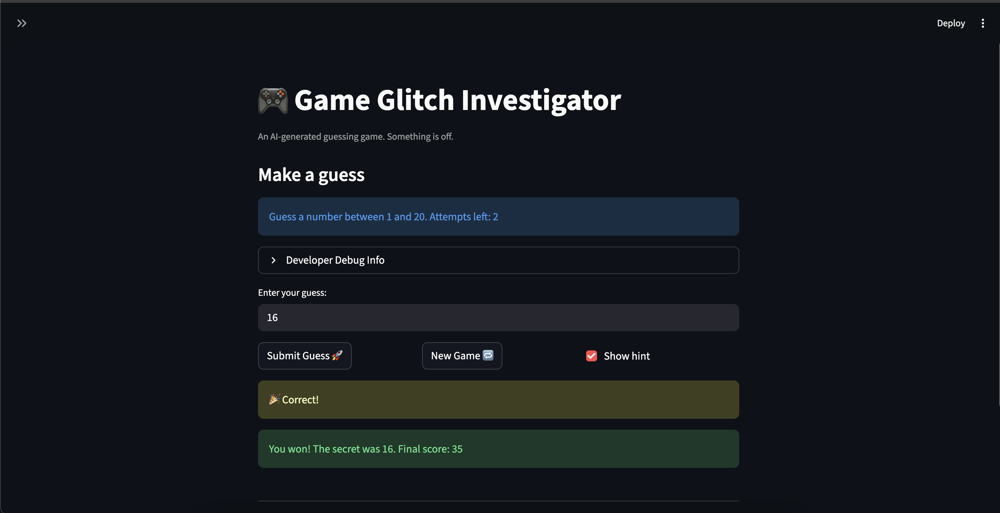
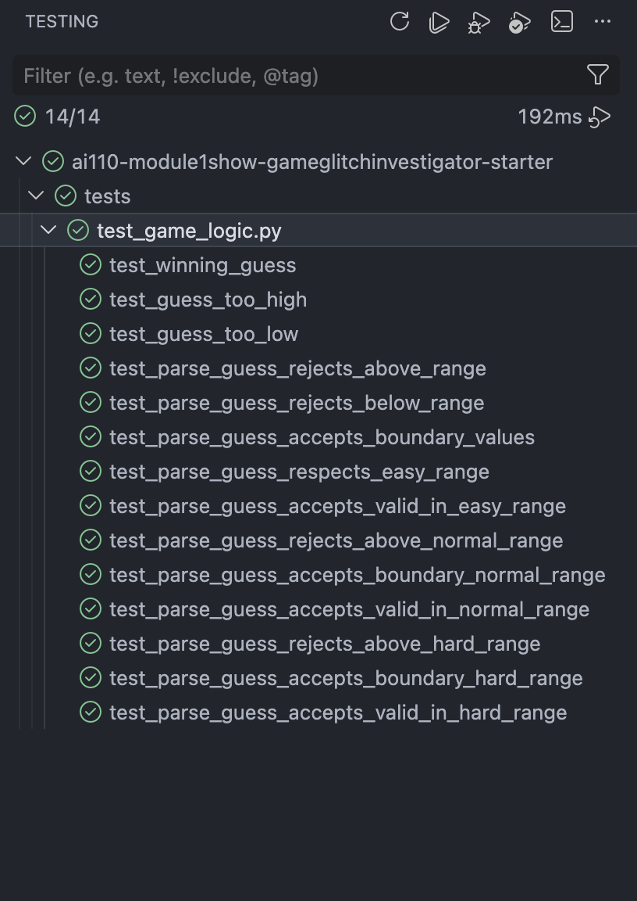

# 🎮 Game Glitch Investigator: The Impossible Guesser

## 🚨 The Situation

You asked an AI to build a simple "Number Guessing Game" using Streamlit.
It wrote the code, ran away, and now the game is unplayable.

- You can't win.
- The hints lie to you.
- The secret number seems to have commitment issues.

## 🛠️ Setup

1. Install dependencies: `pip install -r requirements.txt`
2. Run the broken app: `python -m streamlit run app.py`

## 🕵️‍♂️ Your Mission

1. **Play the game.** Open the "Developer Debug Info" tab in the app to see the secret number. Try to win.
2. **Find the State Bug.** Why does the secret number change every time you click "Submit"? Ask ChatGPT: _"How do I keep a variable from resetting in Streamlit when I click a button?"_
3. **Fix the Logic.** The hints ("Higher/Lower") are wrong. Fix them.
4. **Refactor & Test.** - Move the logic into `logic_utils.py`.
   - Run `pytest` in your terminal.
   - Keep fixing until all tests pass!

## 📝 Document Your Experience

### **The Game's Purpose**

The application is a Number Guessing Game where users try to find a hidden "secret" number within a specific range. Users get to choose between different difficulty levels (Easy, Normal, Hard) which dictates the range and number of allowed attempts. The game also provides hints ("Higher" or "Lower") based on user guesses.

### **Bugs Found**

- **Inverted Hints:** The game gave opposite directional feedback (e.g., "Go Lower" when you needed to go higher).
- **Type Casting Error:** On even-numbered attempts, the secret was compared as a string, causing "34" to be treated as smaller than "4".
- **Input Validation & State:** Out-of-bounds guesses were accepted and penalized with a lost attempt.
- **UI Synchronization:** The "Submit" button required two clicks to register, and the settings menu didn't match the actual gameplay parameters.
- **Hardcoded UI Messages:** The main screen incorrectly displayed a range of "1-100" regardless of the selected difficulty.
- **Broken Game Loop:** The "New Game" button failed to clear history or re-enable the submit button.

### **Fixes Applied**

Using **Claude Code** as by AI teammate, I applied the following fixes:

- **Logic Correction:** Refactored the `check_guess` function to swap the hint labels and ensured all numerical comparisons used strictly **integer types** to avoid lexicographical errors.
- **Validation Logic:** Updated the parsing function to check if a guess falls within the active range before an attempt is deducted.

## 📸 Demo

## 🚀 Stretch Features

- [ ] [If you choose to complete Challenge 4, insert a screenshot of your Enhanced Game UI here]
